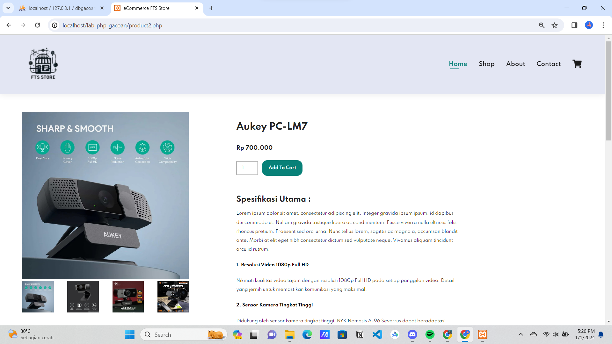

# Tugas RPL { Pertemuan ke 4 } 

|**Nama**|**NIM**|**Kelas**|**Matkul**|
|----|---|-----|------|
|Muhammad Ikhsan Fakhrudin|312210019|TI.22.A.2|RPL|

## Pertanyaan & Tugas

1. Tuliskan Nama Project Sistem Informasi !

2. Tuliskan Analisanya :

- ***Permasalahannya :***
- ***Kebutuhan sistemnya :***

3. Gambarkan usecase Diagramnya !

4. Activity Diagramnya !

5. Sequence Diagramnya !

## Jawab

### 1. Sistem Informasi Penjualan Webcam Di Toko Nina Bobo Berbasis Website

### 2. Tuliskan Analisanya :

### ***Permasalahanya :***

- ``Persaingan Pasar :`` Pasar penjualan online webcam sangat kompetitif, dengan banyak pesaing yang menawarkan berbagai merek dan model webcam. Membangun keunggulan kompetitif dan menarik pelanggan menjadi tantangan utama.

- ``Keamanan Data :`` Keamanan data pelanggan dan informasi pembayaran adalah perhatian utama dalam bisnis e-commerce. Pelanggan harus merasa aman saat bertransaksi online, dan perlindungan data yang kuat adalah keharusan.

- ``Infrastruktur Teknologi : ``Perlu memiliki infrastruktur teknologi yang handal, termasuk server web, kecepatan internet, dan perangkat lunak e-commerce yang dapat diandalkan untuk mengelola situs web.

- ``Desain User-Friendly :`` Desain situs web harus intuitif dan user-friendly agar pelanggan dapat dengan mudah menavigasi produk, melakukan pembelian, dan menemukan informasi yang mereka butuhkan. Dan masih ada lagi di antara nya :

- ``Manajemen Stok `` 

- ``Integrasi Pembayaran  ``

- ``Layanan Pelanggan ``

- ``Pemasaran dan Promosi  ``

### ***Kebutuhan Sistemnya :***

- Website e-commerce yang menjual webcam.

- Fitur ``Augmented Reality`` yang dapat digunakan pembeli agar lebih yakin dengan produk yang akan dibeli.

- Sistem pemantauan ruang berbasis webcam.

- Framework CodeIgniter dapat digunakan sebagai basis perancangan website e-commerce.

- Sistem pembayaran yang aman dan terpercaya.

- Tampilan website yang menarik dan mudah digunakan.

## Use Case Diagram 

## Activity Diagram 

### Activity Diagram Admin

### Activity Diagram Pembeli

### Activity Diagram Pemilik Toko

## Sequence Diagram 

## SELESAI  